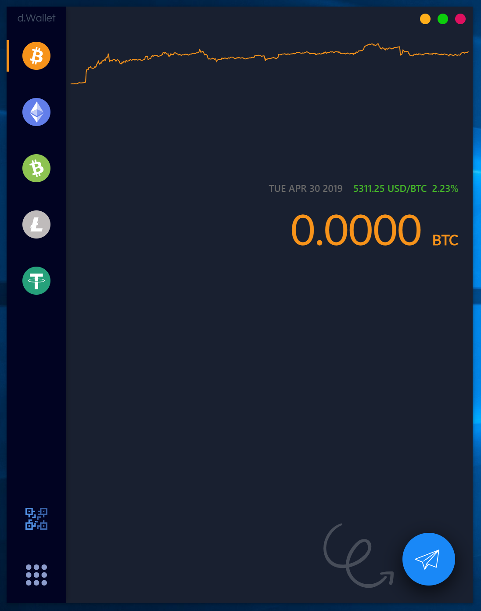

# d.Wallet

A Cryptocurrency Wallet for Desktop

Features:
1. Supports BTC, ETH, BCH, LTC, USDT
2. Add messages when you sending a tx
3. Completely open-source
4. Available on Windows/Mac/Linux

You can download it at [here](https://github.com/UnsignedInt8/d.Wallet/releases).

[Official Website](https://d-wallet.app)

## License

GPL-3.0